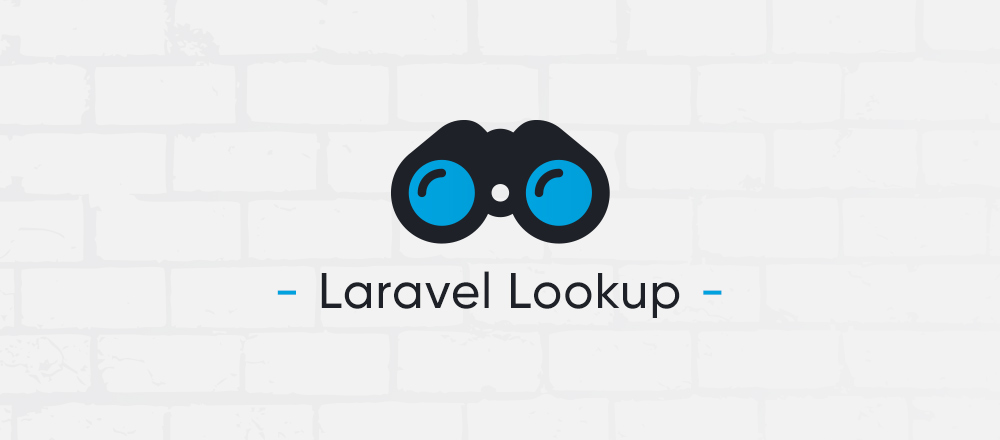

> ⚠️ This Package was originally created on Laravel 7 because it didn't offer this kind of feature. Since Laravel 9 we can use [Enum Eloquent attribute casting](https://laravel.com/docs/9.x/releases#enum-casting), in most cases they can do the same as Laravel-Lookup so we recommend giving them a try instead of our package.

# Laravel Lookup

Laravel Lookup helps to have a place to store static data of your Laravel application with little sugar added to it and Eloquent casts to easily use them in your Laravel models. Useful when you don't want to create database tables for every little things, **think of it as static model**.

<p align="center">
    
</p>

Imagine you have a `Car` model with an attribute `engine` that can have the value `gasoline`, `electric` or `hybrid`. Creating a model and a database table can be overkill for this simple key/value data.

In the past we used language files to store this but would end up having to deal with a simple array when calling `Lang::get('car.engines')`. It felt weird and not realy DRY when needing to add some reusable logic for these data. The main goal was having one stable source to get this data and be able to have some flexibility in it.

With a lookup object (other call it Value object) you'll be able to have a collection containing real objects. It lets you use the power of Laravel collection to easily populate a dropdown select, add form validation, populate factories, etc and with Laravel custom cast we can access them like a real model relation for a nice code readability.

- [Installation](#installation)
- [Usage of Lookup](#usage-of-lookup)
- [Usage of Casts](#usage-of-casts)
- [Configuration](#configuration)

## Installation

You can install the package via composer :

```bash
composer require weblogin/laravel-lookup
```


## Usage of Lookup

With our `Car` model example that have a `engine` attribute we could create a `CarEngineLookup` in `App/Models/Lookups`. It should look like bellow, with a `getItems()` method returning an array, each item of the array should contain the same keys and they need to be declared as public in the class :

```php
namespace App\Models\Lookups;

use WebLogin\LaravelLookup\Lookup;


class CarEngineLookup extends Lookup
{

    public $key;
    public $name;


    protected static function getItems()
    {
        return [
            ['key' => 'gas',    'name' => "Gasoline"],
            ['key' => 'elec',   'name' => "Electric"],
            ['key' => 'hyb',    'name' => "Hybrid"],
        ];
    }

}
```
Because `getItems()` have to return a simple array you can use this package with translation as you like, for example :

```php
// resources/lang/en/car.php
return [
    'engines' => [
        'gas'   => "Gasoline",
        'elec'  => "Electric",
        'hyb'   => "Hybrid",
    ],
];

// resources/lang/fr/car.php
return [
    'engines' => [
        'gas'   => "Essence",
        'elec'  => "Electrique",
        'hyb'   => "Hybride",
    ],
];

// app/Models/Lookups/CarEngineLookup.php
protected static function getItems()
{
    $items = [];
    foreach (Lang::get('car.engines') as $key => $value) {
        array_push($items, ['key' => $key, 'name' => $value]);
    }
    return $items;
}
```

A `Lookup` object can be used as a collection by calling any static method on it, so you can do :

```php
// Get all the CarEngineLookup objects in a collection
CarEngineLookup::collection();

// Filter on the collection (both are equals)
CarEngineLookup::where('key', '!=', 'gas');
CarEngineLookup::collection()->where('key', '!=', 'gas');
```

The `find()` method should be used to find one or multiple lookups in the collection (return null if nothing found) :

```php
// Find one
$engine = CarEngineLookup::find('elec');
$engine->key;     // 'elec'
$engine->name;    // 'Electric'

// Find multiples
$engine = CarEngineLookup::find(['elec', 'hyb']);
```

Populating random values inside model factories

```php
$factory->define(Car::class, function (Faker $faker) {
    return [
        'name'     => $faker->words(3, true),
        'engine'   => CarEngineLookup::random(),
        ...
    ];
});
```

Populating select input and Validation :

```BLADE
<select name="engine">
    @foreach (\App\Models\Lookups\CarEngineLookup::collection() as $engine)
        <option value="{{ $engine->key }}">{{ $engine->name }}</option>
    @endforeach
</select>
```
```php
Validator::make($data, [
    'engine' => ['required', Rule::in(CarEngineLookup::pluck('key'))],
]);
```

Because a `Lookup` is an object you can add attributes (they need to be declared in the class and in the `getItems()` method) and helper methods on the class :

```php
class CarEngineLookup extends Lookup
{

    public $key;
    public $name;
    public $sub;


    protected static function getItems()
    {
        return [
            ['key' => 'gas',    'name' => "Gasoline",    'sub' => 'Lorem ipsum'],
            ['key' => 'elec',   'name' => "Electric",    'sub' => 'Dolor amet'],
            ['key' => 'hyb',    'name' => "Hybrid",      'sub' => 'Consectetur adipiscing'],
        ];
    }


    public function icon()
    {
        return URL::asset("images/engines-" . $this->key . ".svg");
    }


    public function fullname()
    {
        return $this->name . ' - ' . $this->sub;
    }


    public static function onlyGreen()
    {
        return static::collection()->where('key', '!=', 'gas');
    }

}

$engine = CarEngineLookup::find('gas');
$engine->icon();                // 'yourdomaine.com/images/engines-gas.svg'
$engine->fullname();            // 'Gasoline - Lorem ipsum'
CarEngineLookup::onlyGreen();   // Collection without gas item
```


## Usage of Casts

There are 2 casts in this package, both of them uses the primary key of the lookup object to get and set values from the database (go to the Configuration section to read more about the primary key) :

* `LookupCast` to store one lookup key in the database
* `LookupCollectionCast` to store multiple lookup keys in the database

### LookupCast
Still with our `Car` model that have an `engine` attribute, the model would look like this to use the `CarEngineLookup` stored in `App/Models/Lookups`:

```php
...
use WebLogin\LaravelLookup\LookupCast;


class Car extends Model
{

    protected $casts = [
        'engine' => LookupCast::class.':'. Lookups\CarEngineLookup::class,
    ];

}
```
In your code you can now access the `engine` attribute object :

```php
$car = new Car();
$car->engine = 'elec';
$car->engine->name;     // 'Electric'
$car->engine->key;      // 'elec'
$car->engine->icon();   // 'yourdomaine.com/images/engines-elec.svg'

```
*Note: If the key is not in the collection the attribute equals to NULL.*

### LookupCollectionCast
Now our `Car` model needs a `options` attribute that should store multiple options coming from a lookup `CarOptionLookup` :

```php
use WebLogin\LaravelLookup\Lookup;


class CarOptionLookup extends Lookup
{

    public $key;
    public $name;


    protected static function getItems()
    {
        return [
            ['key' => 'airbag',    'name' => "Airbag"],
            ['key' => 'abs',       'name' => "Antilock braking system"],
            ['key' => 'rear-cam',  'name' => "Rear camera"],
            ['key' => 'front-cam', 'name' => "Font camera"],
        ];
    }

}
```

```php
use WebLogin\LaravelLookup\LookupCollectionCast;


class Car extends Model
{

    protected $casts = [
        ...
        'options' => LookupCollectionCast::class.':'. Lookups\CarOptionLookup::class,
    ];

}
```
In your code you can now access the `options` attribute that return a collection :

```php
$car = new Car();

// Set multiple keys
$car->options = ['airbag', 'abs'];
$car->options;                 // Collection
$car->options->first()->name;  // 'Airbag'

// Set one key (both are equals)
$car->options = ['airbag'];
$car->options = 'airbag';

// You can also use Lookup objects
$car->options = CarOptionLookup::find('airbag');

```
*Note: If the keys are not in the collection the attribute equals to NULL.*

### Search in database
For `LookupCast` you can do a simple `where()` query, nothing special :

```php
Car::where('engine', 'elec')->get();
```
For `LookupCollectionCast`, the values are stored in the database as JSON so you can use `whereJsonContains()` but if you pass multiple keys this method search for the presence of each key. To search the presence of at least one key the package include a new database query method `whereInLookupCollection($column, $values)` :

```php
Car::whereInLookupCollection('options', 'airbag')->get();
Car::whereInLookupCollection('options', ['rear-cam', 'abs'])->get();

// You can also pass Lookup object
$foo = CarOptionLookup::find('airbag');
Car::whereInLookupCollection('options', $foo)->get();
```

## Configuration

### Database column type
Set database column that will store the value according to your `Lookup` usage, `VARCHAR` for single value and `JSON` for multiple values.

### Primary key

By default a `Lookup` needs to have `key` attribute defined for each item and it needs to be unique (it can by a `string` or `int`). It's used to retrieve the object from the collection. But you can override this primary key by adding a `$primaryKeyName` attribute to the class :

```php
class CountryLookup extends Lookup
{

    public $code;
    public $name;
    protected static $primaryKeyName = 'code';


    protected static function getItems()
    {
        return [
            ['code' => 'fra',   'name' => "France"],
            ['code' => 'usa',   'name' => "United States of America"],
            ...
        ];
    }

}
```


## License

The MIT License (MIT). Please see [License File](LICENSE.md) for more information.
